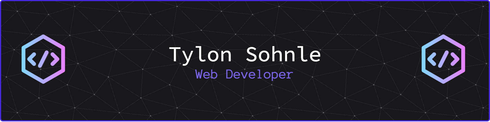

##  🧙‍♂️ Hi, I'm Ty! 

I'm a Web Developer with a strong enthiusiasm for creating beautiful and intuitive user interfaces.  
 <!--I was drawn to web development because I love the process of bringing ideas to life, from a design concept to a fully functional website/webapp.-->
I Studied Web Development at the Northern Alberta Institute of Technology in Alberta, Canada. 

### 🛠️ My Tech Stack & Tools

**Languages:**

  
  
  
  
  

**Frameworks & Libraries:**

  
  
  

**Tools & Platforms:**

  
  
  
  
  

  

### 📊 My GitHub Stats

  

<!--### 🏆 My GitHub Trophies

  

-->

